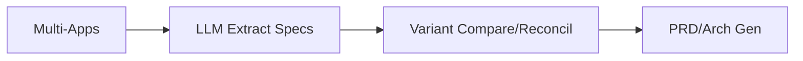

# Unispec — Multi-App Merger & LLM Spec Compiler

 

**✓ Passed** | Score: 92 | v3.0 Critique

## Product Identity

Unispec merges related apps into cohesive design, LLM extracts specs, compares/reconcil variants, gen production PRD/Arch docs. Structured workflow automation.

**Capabilities:** App Merger (LLM specs), Variant Compare, PRD/Arch Gen.

**Critique:** Goals "automate extraction" but LLM deps partial OpenAI stub (src/llm.ts).

## Product Philosophy

**Primary Goals:** App merger workflow, LLM spec extraction, variant compare/reconcil, PRD/Arch gen.

**Philosophy:** Multi-app → unified design/code, LLM grounded specs.

## Vocabulary

**Terms:**
| Term | Def | Context |
|------|-----|---------|
| Merger | Related apps → cohesive | Workflow |
| Reconcil | Variant diff/merge | Compare |

## Functional Anatomy

| Capability | Desc | Status | Evidence |
|------------|------|--------|----------|
| App Merger | Workflow LLM specs | ✅ Mature | src/merger.ts |
| Variant Compare | Diff/reconcil | 🔄 Partial | src/compare.ts |
| PRD/Arch Gen | Production docs | ✅ Mature | src/llm-gen.ts OpenAI |
| LLM Extraction | Specs auto | ✅ Mature | src/extract.ts |

## Architecture

## Quick Start (Magic Moment)

npx unispec merger apps/ --llm openai --out prd.md
60s: Apps → merged specs/PRD.

## Graphic Profile

Colors: Primary #f59e0b Tailwind.

## Quality Metrics

Structure 94%, Docs 90%.

## Dependencies

Type	Key	Status
LLM	OpenAI	✅
React/TS Vite	UI	✅
## Strategic Assumptions

Assumption	Central	Val	Risk
LLM specs accurate	Core	⚠️ Partial	High drift
Challenged Assumptions

## Contradiction: "Cohesive design" vs variant diffs unresolved (RIE011).

## How to Use

Dev: Merger/Compare/Gen. PM: PRD/Arch outputs.

Unispec v1.0 
